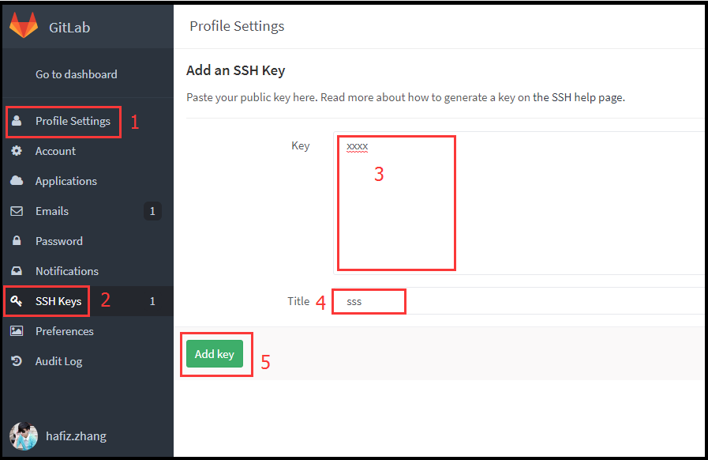
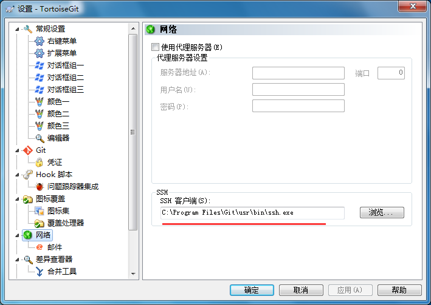

## 下载

> 默认下载日期最新即可
>
> https://npm.taobao.org/mirrors/git-for-windows/

## 可视化客户端（可选）

### TortoiseGit

#### 下载地址包括汉化包

> https://tortoisegit.org/download/

#### ssh 密钥配置

1. 打开 git bash
2. 输入命令`ssh-keygen -t rsa -C 'xxx@xxx.com'`
3. 打开`~/.ssh/id_rsa.pub`目录(~表示用户目录，比如我的 windows 就是 C:\Users\Administrator)，复制其中的内容
4. 打开`gitlab`,找到`Profile Settings`-->`SSH Keys`--->`Add SSH Key`,并把上一步中复制的内容粘贴到 Key 所对应的文本框，在 Title 对应的文本框中设置一个名字，点击 Add key 按钮
   
5. 至此 使用 git bash 可以使用 ssh 协议进行代码的管理，**_但是 TortoiseGit 使用扩展名为 ppk 的密钥，而不是 ssh-keygen 生成的 rsa 密钥。_**
6. 所以设置 TortoiseGit 中的 SSH 客户端为 Git 中的 SSH 客户端，`右键`>`TortoiseGit`>`设置`>`网络`
   
